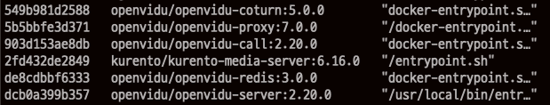

# 서비스 배포 문서

## 배포 환경

- Ubuntu 20.04 LTS (GNU/Linux 5.4.0-1018-aws x86_64)
- 환경에 따라 vi, nano / ssh, bash 같은 명령어가 달라질 수 있으니 주의
- 처음부터 끝까지 쉬지 않고 진행하는 것이므로, 현재 경로(위치)에 유의

## Docker, docker-compose 설치

```shell
# 사용자 root로 변경
sudo su

apt-get update

apt-get install \
	apt-transport-https \
	ca-certificates \
	curl \
	gnupg \
	lsb-release

-fsSL https://download.docker.com/linux/ubuntu/gpg | sudo gpg --dearmor -o
/usr/share/keyrings/docker-archive-keyring.gpg

echo \
	"deb [arch=amd64 signed-by=/usr/share/keyrings/docker-archive-keyring.gpg]
	https://download.docker.com/linux/ubuntu \
	$(lsb_release -cs) stable" | sudo tee /etc/apt/sources.list.d/docker.list > /dev/null

apt-get install docker-ce docker-ce-cli containerd.io

curl -L "https://github.com/docker/compose/releases/download/1.29.2/docker-compose-$(uname -s)-$(uname -m)" -o /usr/local/bin/docker-compose

chmod +x /usr/local/bin/docker-compose
```

## OpenVidu Server 설치

1. OpenVidu 파일 다운로드

```shell
cd /opt # 이후 작업하는 파일들도 opt에서 작업합니다.

curl https://s3-eu-west-1.amazonaws.com/aws.openvidu.io/install_openvidu_latest.sh | sudo bash
```

2. 환경 설정 파일 수정(.env)

```shell
cd /opt/openvidu

vi .env

# 에디터에서 아래의 값을 찾아서 변경
DOMAIN_OR_PUBLIC_IP=<서버 주소 또는 도메인>
OPENVIDU_SECRET=<서버 비밀번호>
CERTIFICATE_TYPE=letsencrypt # letsencrypt를 사용하여 SSL 인증서 발급
LETSENCRYPT_EMAIL=<이메일> # letsencrypt에서 사용할 이메일
HTTP_PORT=<포트 번호>
HTTPS_PORT=<포트 번호>
# 포트 번호 이후에 수정 예정
```

3. OpenVidu 서버 실행

```shell
./openvidu start
```

4. 서버 실행 여부 확인

```shell
docker ps
```



5. 포트 변경을 위한 서버 종료

```shell
./openvidu stop
```

6. 환경 설정 파일 포트번호 수정

```shell
HTTP_PORT=<변경 포트 번호>
HTTPS_PORT=<변경 포트 번호>
```

7. OpenVidu 서버 재시작

```shell
./openvidu start
```

## DB 설치

1. Docker를 활용하여 mariaDB 10.2 설치

```shell
docker run --name mariadb -d -p <DB 포트 번호>:<DB 포트 번호> -e MYSQL_ROOT_PASSWORD=<root 비밀번호> mariadb:10.2
```

2. MySQL Workbench 등을 사용하여 root로 접속 후 아래 파일의 sql문 실행

## 프로젝트 컨테이너 적재

- 미리 빌드해둔 파일을 이용하여 프로젝트를 배포합니다.

1. git 설치 후 저장소 clone

```shell
apt-get update

apt-get install git

cd /opt

git clone https://lab.ssafy.com/s06-webmobile1-sub2/S06P12A106.git # 이후에 나오는 git 사용자 아이디 비밀번호 입력
```

2. docker-compose 활용하여 프로젝트 앱 컨테이너 적재

```shell
cd /opt/S06P12A106/backend/docker

docker-compose up --build -d springboot
```

## SSL 인증서 발급 및 프로젝트 배포

1. 인증서 발급을 위한 코드 작성 및 수정

```shell
cd /opt/S06P12A106/backend/docker

vi /opt/nginx/conf.d/nginx.conf
# 아래의 코드 입력
server {
     listen <포트 번호>;
     listen [::]:<포트 번호>;

     server_name <도메인 ip 또는 이름> # <>괄호 지우고 입력할 것

     location /.well-known/acme-challenge/ {
             allow all;
             root /var/www/certbot;
     }
}

vi /opt/S06P12A106/backend/docker/init-letsencrypt.sh
# 아래의 내용 변경
domains="<도메인 ip 또는 이름>" # <>괄호는 지우고 ""는 길 것
email="<이메일>" # <>괄호는 지우고 ""는 길 것
```

2. 위에서 수정한 init-letsencrypt.sh 파일 실행

```shell
./init-letsencrypt.sh

# IMPORTANT NOTES: - Congratulations! 가 떠야 정상적으로 인증서가 발급된 것
```

3. NGINX 서버 설정 추가

```shell
vi /opt/nginx/conf.d/app.conf

# 아래의 내용 복사 및 <> 내용 변경, <>괄호도 지울 것
server {
    listen <포트 번호>;
    listen [::]:<포트 번호>;

    server_name <도메인 ip 또는 이름>;

    location /.well-known/acme-challenge/ {
            allow all;
            root /var/www/certbot;
    }

    location / {
        return 301 <도메인 ip 또는 이름>$request_uri;
    }
}

server {
    listen <포트 번호> ssl;
    server_name <도메인 ip 또는 이름>;

    ssl_certificate /etc/letsencrypt/live/<도메인 ip 또는 이름>/fullchain.pem;
    ssl_certificate_key /etc/letsencrypt/live/<도메인 ip 또는 이름>/privkey.pem;
    include /etc/letsencrypt/options-ssl-nginx.conf;
    ssl_dhparam /etc/letsencrypt/ssl-dhparams.pem;

    location / {
        proxy_pass http://springboot:<포트 번호>;
        proxy_set_header    Host                $http_host;
        proxy_set_header    X-Real-IP           $remote_addr;
        proxy_set_header    X-Forwarded-For     $proxy_add_x_forwarded_for;
    }
}

docker-compose up --build -d nginx # NGINX 재시작
```

## 참고 문서

- [OpenVidu 서버 구축](https://github-wiki-see.page/m/483759/Square4Us/wiki/Openvidu-%EA%B5%AC%EC%B6%95-%EA%B3%BC%EC%A0%95)
- [Docker NGINX SSL 인증서 설치/배포](https://velog.io/@fordevelop/Docker-Nginx-Certbot-Lets-Encrypt%EB%A5%BC-%EC%82%AC%EC%9A%A9%ED%95%B4-SSL-%EC%9D%B8%EC%A6%9D%EC%84%9C-%EB%B0%9C%EA%B8%89)

## 테스트 코드
- [방 생성 통합 테스트](https://lab.ssafy.com/s06-webmobile1-sub2/S06P12A106/-/blob/develop/exec/TestCode/RoomServiceImplTest.java)
- [목록 조회 단위 테스트](https://lab.ssafy.com/s06-webmobile1-sub2/S06P12A106/-/blob/develop/exec/TestCode/ListServiceImplTest.java)
- [목록 조회 통합 테스트](https://lab.ssafy.com/s06-webmobile1-sub2/S06P12A106/-/blob/develop/exec/TestCode/ListControllerTest.java)
