# 시연 시나리오

## 랜딩 페이지

랜딩페이지에 접속하면 2022 팬톤 올해의 컬러 베리 페리로 꾸민 “빠뤼 피플”의 로고가 사용자를 환영해줍니다. 파티에 대한 기대를 가득 품은 채 START 버튼을 클릭하면 메인 페이지로 입장할 수 있습니다.

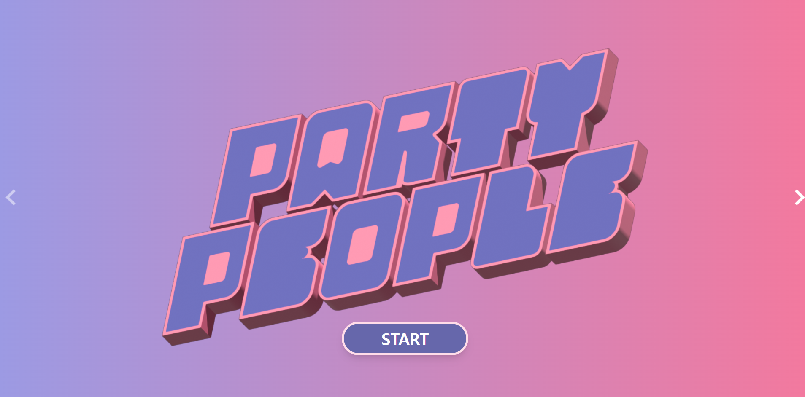

 

## 파티룸 목록 페이지(메인 페이지)

### 회원가입, 로그인, 로그아웃

회원가입 및 로그인을 하지 않아도 파티룸 목록을 조회할 수 있습니다.
파티룸에 접속하여 화상 파티를 즐기기 위해서는 회원 정보를 등록하고 로그인해야 합니다.

메인 페이지 우측 상단 Sign-Up 버튼을 클릭하면 회원가입 모달이 팝업됩니다. 정보를 입력하고 가입하기 버튼을 클릭하면 회원가입이 완료됩니다.

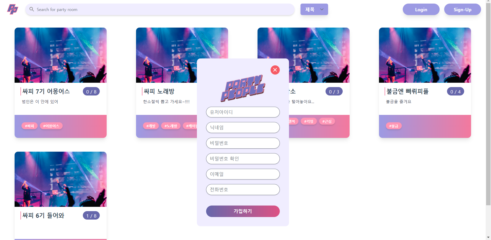

메인 페이지 우측 상단 Login 버튼을 클릭하면 로그인 모달이 팝업됩니다. 정보를 입력하고 로그인 버튼을 클릭하면 로그인이 완료됩니다.

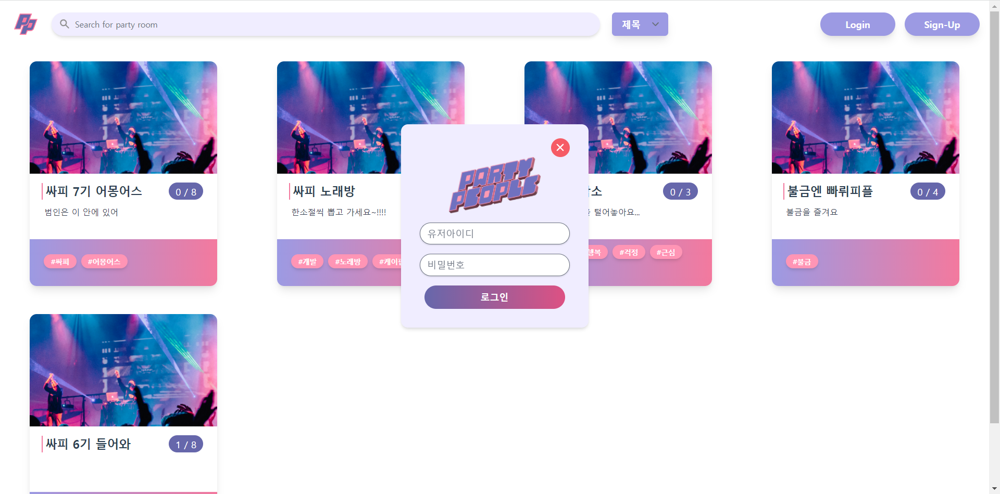

 

### 파티룸 검색

메인 페이지에는 전체 파티룸 목록이 출력됩니다.

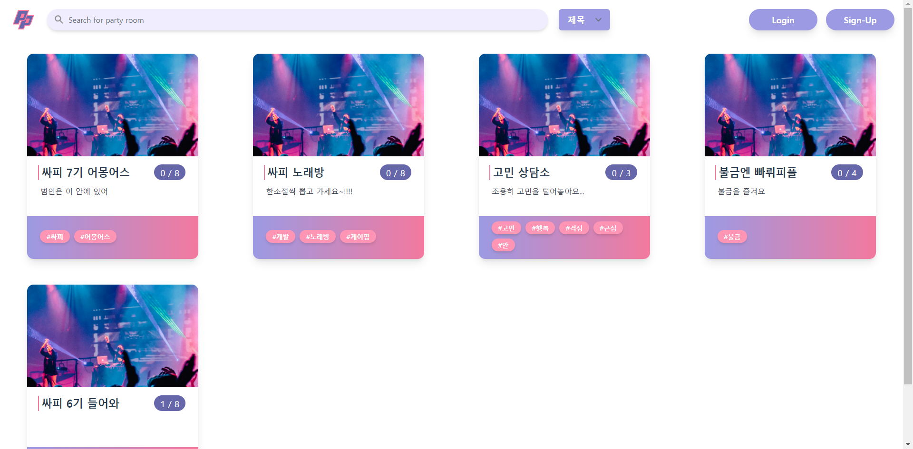

사용자는 자신이 원하는 파티룸을 검색하여 입장할 수 있습니다. 페이지 상단 가운데 검색 input 우측에는 검색 조건을 위한 select 메뉴가 존재합니다. select 메뉴의 option인 제목, 내용, 태그 중 한가지 항목을 선택한 뒤 검색을 희망하는 문자열을 입력합니다. 제목, 내용, 태그에 해당 문자열이 포함된 파티룸이 검색됩니다.

태그 검색의 경우 조금 특별합니다. 해시태그(#)가 붙은 단어 형태의 문자열을 통해 관심사나 특징을 손쉽게 검색할 수 있습니다. 사용자가 띄어쓰기(space)를 입력할 경우 자동으로 문자열 앞에 해시태그가 입력되어 문자열이 분리됩니다. 다양한 태그를 조합하여 파티룸 검색 결과를 얻을 수 있습니다.

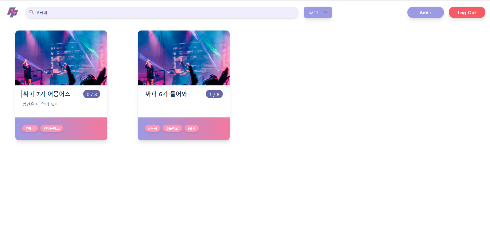

 

### 파티룸 입장

참여를 희망하는 파티룸을 클릭합니다. 파티룸에 비밀번호가 설정되어 있을 경우 올바른 비밀번호를 입력해야 입장할 수 있습니다.

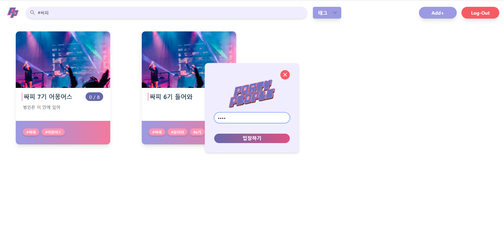

 

## 파티룸 내부 페이지

파티룸에 입장하면 WebRTC 기술을 활용하여 다양한 원격 사용자와 실시간 화상 통화 기반 파티를 즐길 수 있습니다.

### 비디오, 오디오 on/off

파티룸 내부 하단에는 비디오와 오디오를 켜고 끌 수 있는 버튼이 존재합니다. 카메라 아이콘 버튼을 클릭할 경우 자신의 비디오 공유를 중지할 수 있습니다. 중지 기간 동안 파티룸에 접속한 모든 사용자들에게 자신의 비디오 화면은 송출되지 않습니다. 카메라 아이콘 버튼을 한번 더 클릭할 경우 자신의 비디오 공유를 다시 시작할 수 있습니다.

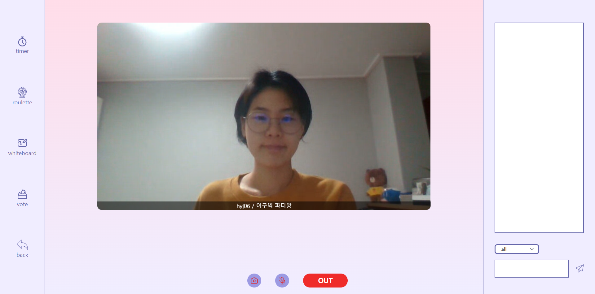

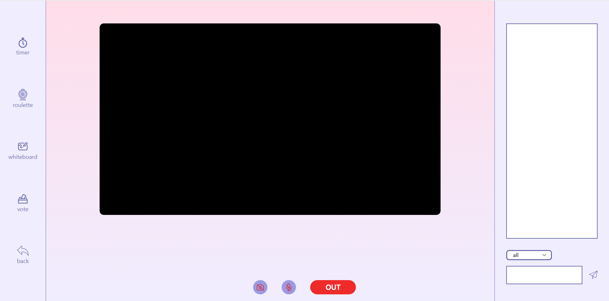

마이크 아이콘 버튼을 클릭할 경우 자신의 오디오 공유를 중지할 수 있습니다. 중지 기간 동안 파티룸에 접속한 모든 사용자들에게 자신의 마이크 오디오는 송출되지 않습니다. 마이크 아이콘 버튼을 한번 더 클릭할 경우 자신의 마이크 오디오 공유를 다시 시작할 수 있습니다.

 

### 채팅 송수신

파티룸 내부 우측에는 원격의 사용자들과 채팅을 주고받을 수 있는 채팅바가 위치해있습니다. 채팅바의 select 메뉴를 클릭하면 채팅을 보낼 사용자 아이디를 선택할 수 있습니다. all 항목을 클릭할 경우 모든 사용자와 공개적인 메시지를 주고 받을 수 있습니다. 특정 사용자 아이디를 클릭할 경우 특정 사용자에게만 보이는 개인적인 메시지를 주고 받을 수 있습니다.

메시지를 보낼 사용자를 선택한 뒤 채팅바 하단 input 박스에 메시지 내용을 입력하고 엔터를 누르면 해당 사용자에게 메시지가 전송됩니다.

주고 받은 메시지는 파티룸을 퇴장하기 전까지 채팅바 상단 채팅 내용 컴포넌트에서 확인할 수 있습니다. 자신이 보낸 메시지는 우측 정렬, 다른 사용자가 보낸 메시지는 좌측 정렬되어 표시됩니다.

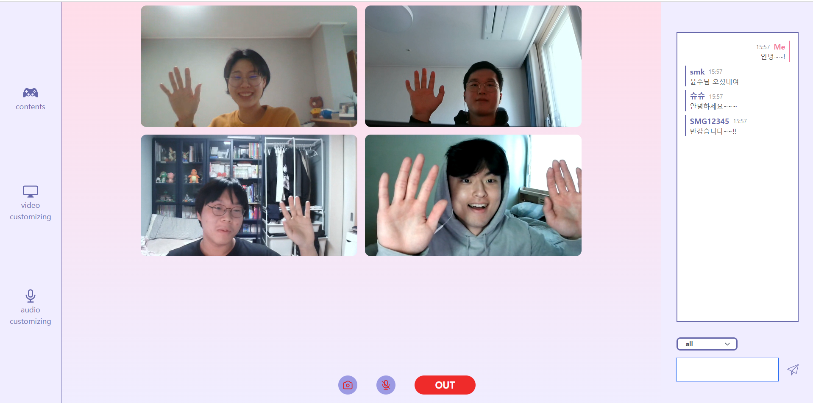

 

### 비디오 커스텀

파티룸 내부 좌측에는 파티를 즐길 수 있는 다양한 기능이 담긴 사이드바가 위치해있습니다. 사이드 바의 video customizing 메뉴를 클릭할 경우 자신의 비디오를 꾸밀 수 있는 비디오 커스텀 설정 모달이 팝업됩니다. 모달의 좌측 하단 select 메뉴를 클릭하면 스티커, 필터, 문구 중 선택하여 커스텀 필터를 적용할 수 있습니다. 또한 모달 내에서 미리보기 기능을 제공하여 커스텀을 설정할 경우 자신의 비디오 화면이 다른 사용자에게 어떻게 보일지 예측할 수 있습니다.

스티커 메뉴에서는 모자, 만화 눈, 이모티콘, 선글라스 등 다양한 스티커 테마를 제공합니다. 또한 스티커는 비디오에서 사용자의 얼굴을 인식하여 얼굴 부위에 적합한 형태로 스티커를 부착합니다. 따라서 사용자는 스티커의 위치나 크기를 조정할 필요 없이 테마만 선택하여 간편하게 즐길 수 있습니다.

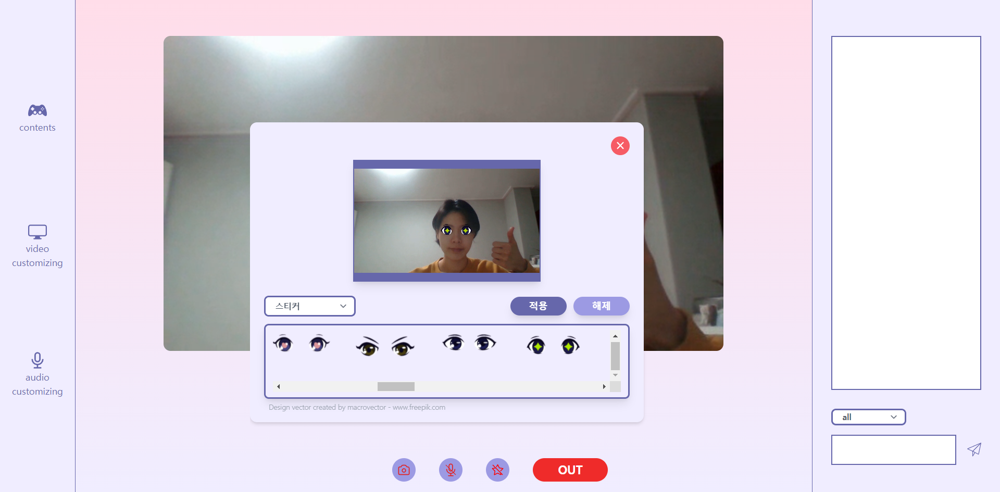

필터 메뉴에서는 옛날풍, 물방울, 잔상, 현기증, 괴물 등 다양한 비디오 필터 테마를 제공합니다. 필터는 사용자의 움직임을 감지하여 특정 행동이나 변화가 있을 경우 이를 강조하여 표현해줍니다.

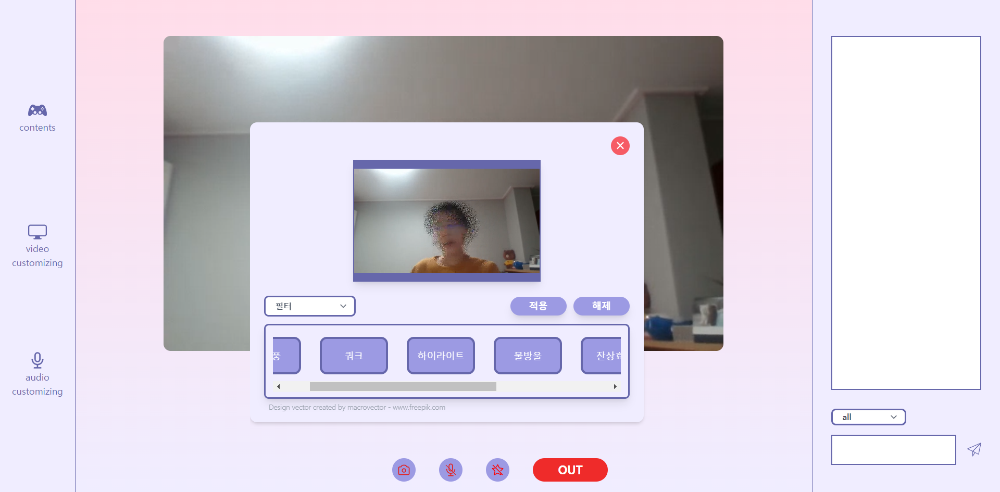

문구 메뉴를 통해 사용자는 자신의 비디오에 원하는 문구를 자유롭게 띄울 수 있습니다. 폰트, 위치, 크기를 선택한 뒤 하단에 직접 문자열을 입력하면 자신의 비디오 화면과 함께 문구가 출력됩니다.

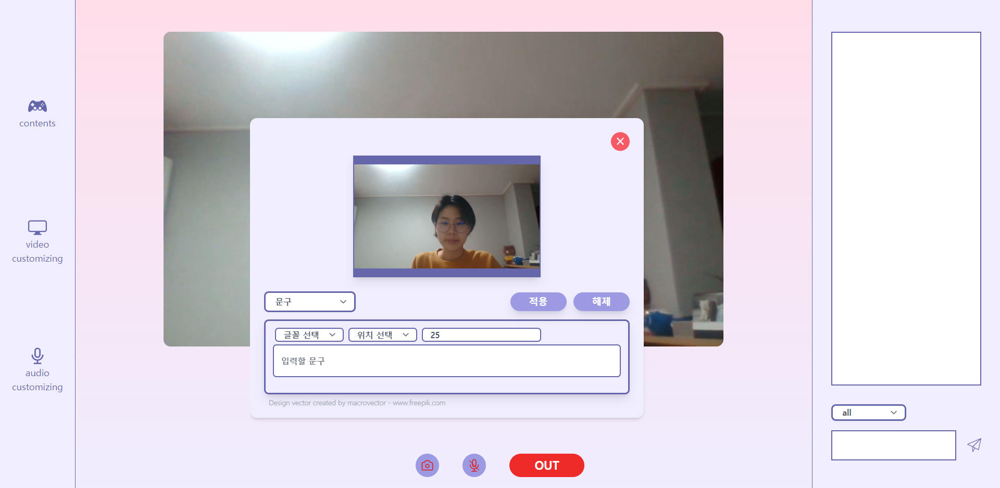

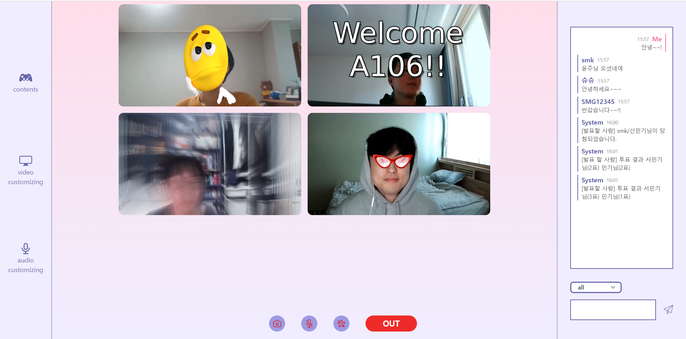

 

### 오디오 커스텀

사이드 바의 audio customizing 메뉴를 클릭할 경우 자신의 목소리를 꾸밀 수 있는 오디오 커스텀 설정 모달이 팝업됩니다. 에코, 중후한 목소리, 촐싹거리는 목소리 등 다양한 음성 필터를 선택하고 적용 버튼을 클릭하면 해당 필터로 목소리를 변조할 수 있습니다. 다른 사용자들의 목소리도 변조된 상태로 들을 수 있습니다.

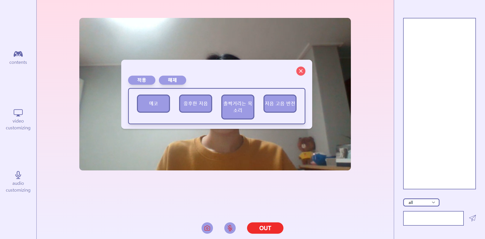

 

### 타이머

사이드 바의 contents 메뉴를 클릭하면 사이드 바 메뉴가 컨텐츠 세부 메뉴로 변경됩니다. 이 중 timer 메뉴를 클릭하면 타이머 설정 모달이 팝업됩니다.

시간을 설정한 뒤 START 버튼을 클릭하면 해당 시간동안 타이머가 동작됩니다. 타이머가 동작되는 동안에는 파티룸 내부 페이지 상단에 남은 시간이 표시됩니다. 또한 사용자들은 타이머와 다른 기능을 동시에 사용할 수 있습니다.

타이머가 종료되면 파티룸에 접속한 모든 사용자에게 알림음이 울리고 토스트 메시지가 팝업됩니다.

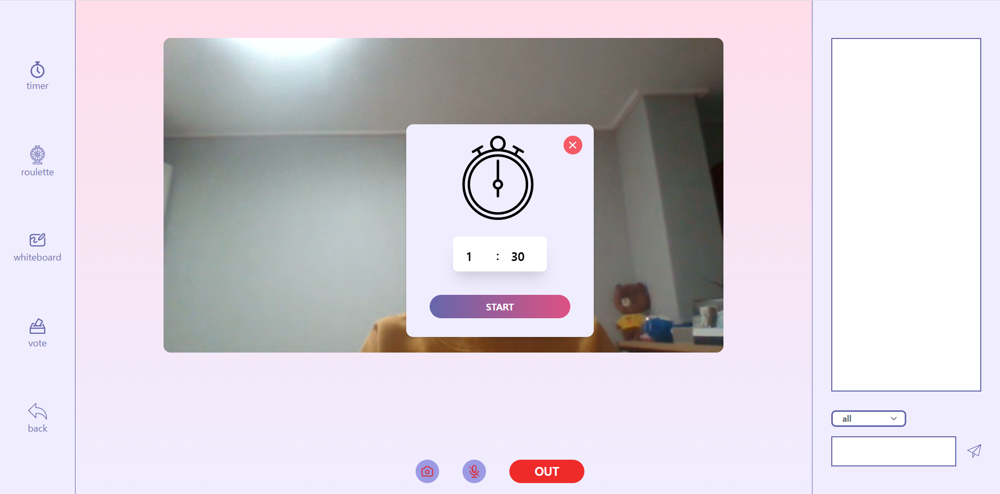

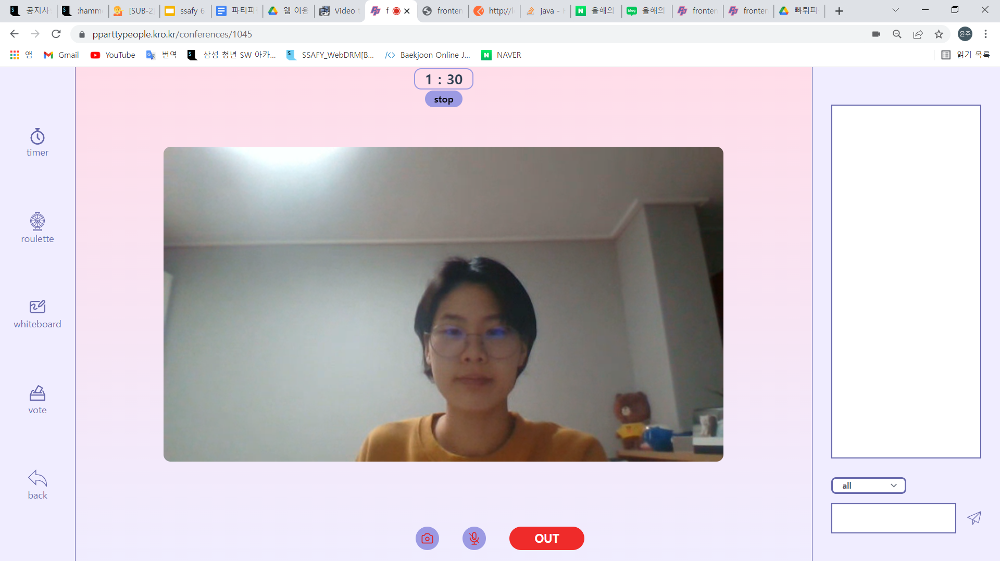

 

### 룰렛

사이드 바에서 roulette 메뉴를 클릭하면 룰렛 설정 모달이 팝업됩니다.

룰렛의 제목을 입력하고 START 버튼을 클릭하면 해당 제목으로 룰렛이 자동 실행됩니다. 룰렛은 파티룸에 접속한 사용자들 중 한 명을 랜덤으로 선택합니다. 룰렛은 게임 도중 벌칙 대상자를 선정하거나 경품 당첨자를 추첨하는 방향으로 활용될 수 있습니다.

룰렛이 종료되면 토스트 메시지로 당첨자가 팝업되고, 룰렛 제목과 함께 당첨자 이름이 우측 채팅 바에 로그로 기록됩니다.

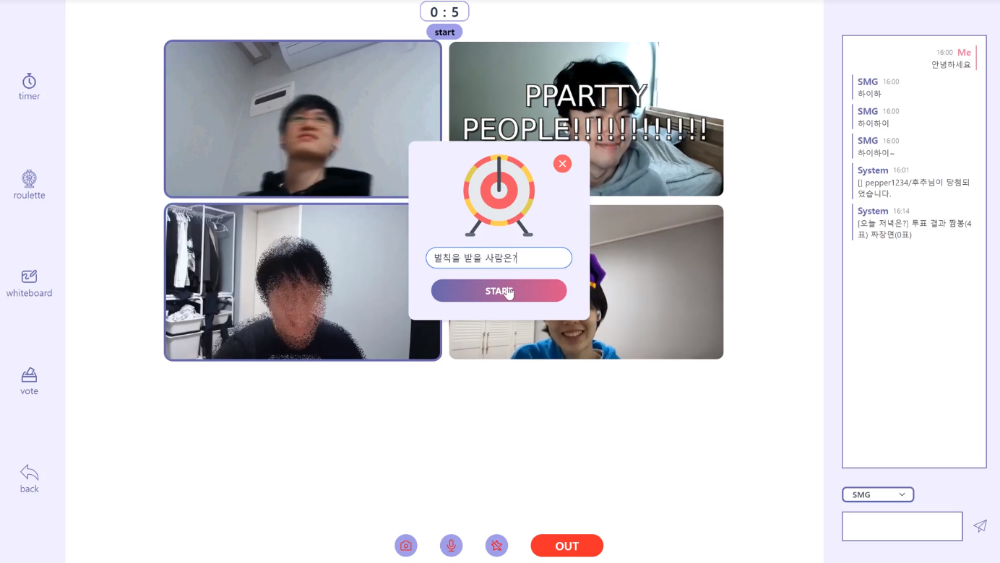

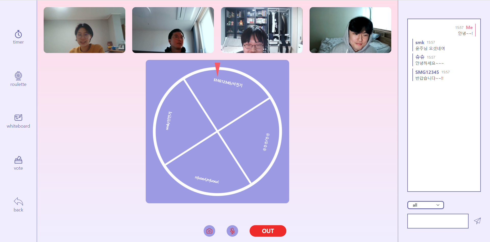

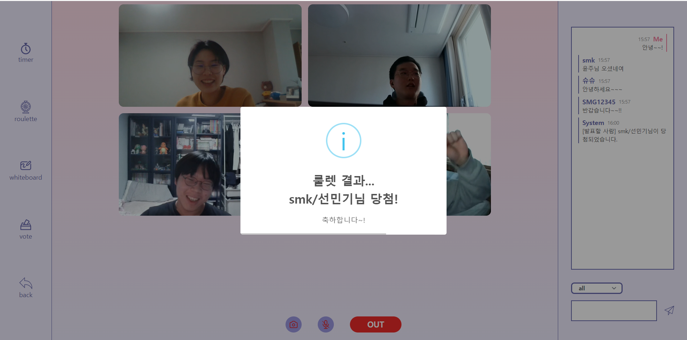

 

### 화이트 보드

사이드 바에서 whiteboard 메뉴를 클릭하면 파티룸 내부에 화이트 보드 컴포넌트가 추가됩니다.

화이트 보드 좌측에서 펜 굵기, 색상을 선택한 뒤 우측 캔버스를 마우스로 드래그하면 그림을 그릴 수 있습니다. 자신이 그린 그림은 파티룸에 접속한 모든 사용자들이 실시간으로 확인할 수 있고, 동일하게 다른 사용자가 그린 그림 역시 자신의 화면에 표현됩니다.

그림을 지우고 싶을 경우 지우개와 reset 기능을 사용할 수 있습니다. 화이트 보드 좌측에서 지우개와 굵기를 선택한 뒤 우측 캔버스를 마우스로 드래그하면 그림을 지울 수 있습니다. 또한 지우개 대신 reset 버튼을 클릭하면 우측 캔버스 그림이 한번에 제거됩니다.

화이트 보드를 닫고 싶을 경우 좌측 close 버튼을 클릭하거나 사이드 바의 whiteboard 메뉴를 한번 더 클릭하면 토글 형식으로 열고 닫을 수 있습니다.

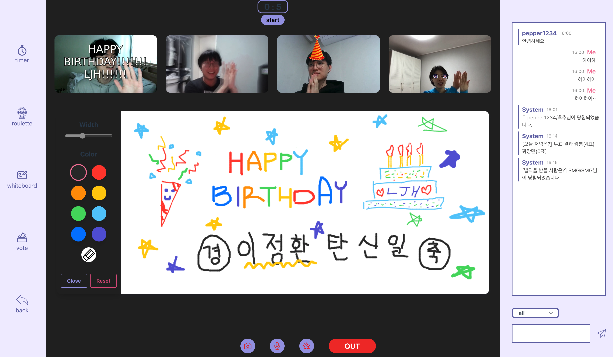

 

### 투표

사이드 바에서 vote 메뉴를 클릭하면 투표 설정 모달이 팝업됩니다. 투표의 제목을 입력하고 투표 항목을 입력한 뒤 START 버튼을 클릭하면 투표가 진행됩니다.

파티룸에 접속한 모든 사용자에게 기표 모달이 전송되고 사용자는 모달 내 항목 우측 radio 버튼을 클릭하여 투표할 수 있습니다.

모든 사용자가 투표를 완료하면 투표 내역을 바탕으로 최다 득표 항목을 선정합니다. 비밀 투표가 가능하기 때문에 파티룸 내부 모든 사용자의 의견이 반영되어야 하는 의사결정에서 활용될 수 있습니다.

투표가 종료되면 토스트 메시지로 최다 득표 항목이 팝업되고, 투표 제목과 함께 각 항목 별 득표 수가 우측 채팅 바에 로그로 기록됩니다.

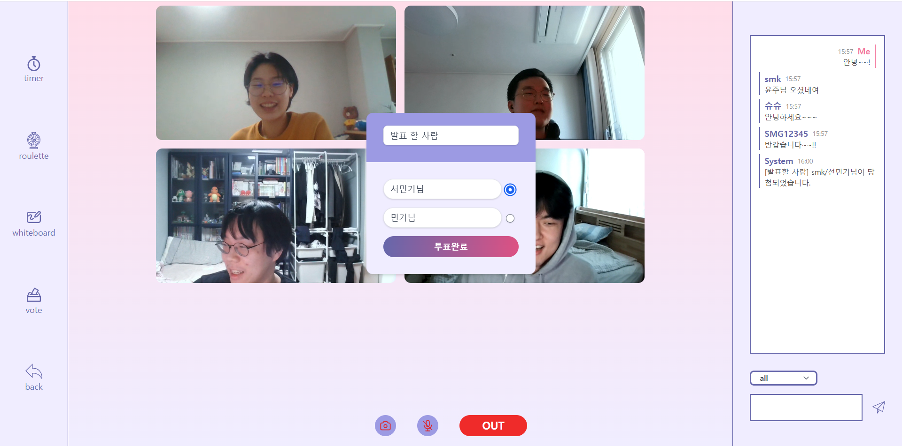

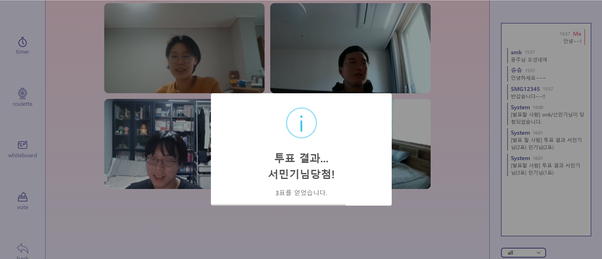

 

### 퇴장

파티룸 내부 하단의 OUT 버튼을 클릭하여 파티룸 세션과의 접속을 종료합니다. 성공적으로 퇴장하면 서비스 메인 페이지인 파티룸 목록 페이지로 이동할 수 있습니다.

 
